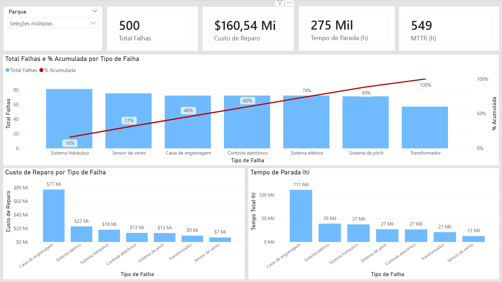
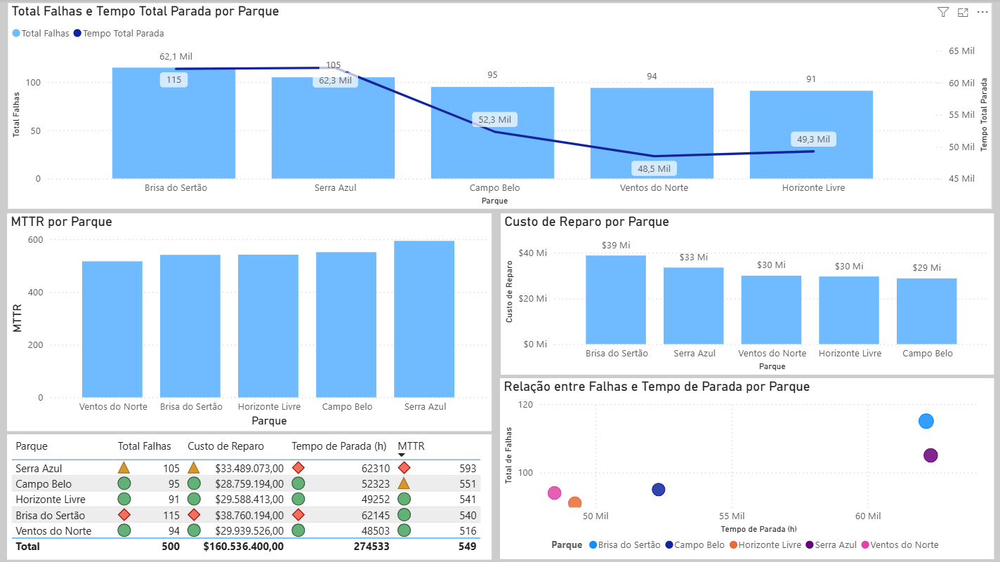
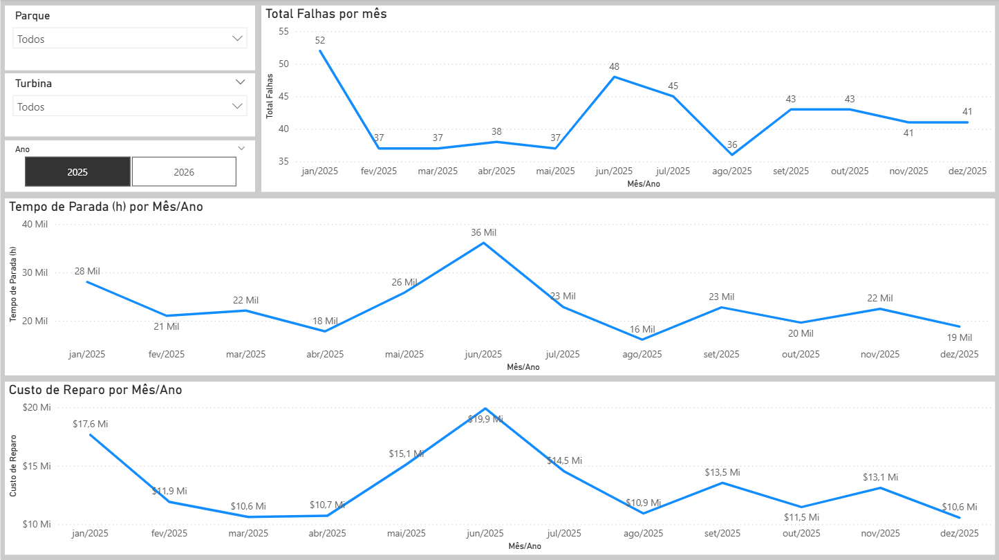

# Dashboard de Manutenção de Aerogeradores (Power BI)

Este projeto apresenta um dashboard desenvolvido em **Power BI** para análise de manutenção de aerogeradores. O objetivo é identificar padrões de falhas, analisar impactos operacionais e avaliar custos de manutenção.

## Objetivo do Projeto

O dashboard permite analisar:

- Volume de falhas por tipo de componente
- Tempo total de parada operacional
- Custos de reparo
- Desempenho comparativo entre parques
- Tendências de falhas ao longo do tempo

Essas análises auxiliam na **identificação de criticidade operacional e priorização de ações de manutenção**.

---

## Estrutura do Dashboard

### Página 1 — Visão Executiva

Apresenta uma visão geral da operação, incluindo:

- Total de falhas
- Custo total de reparo
- Tempo total de parada
- MTTR (Mean Time To Repair)

Também inclui análise **Pareto de tipos de falha**, permitindo identificar os componentes que mais impactam a operação.
---

### Página 2 — Análise por Parque

Comparação entre parques eólicos considerando:

- Total de falhas
- Tempo de parada
- Custos de reparo
- MTTR por parque

Essa análise permite identificar **parques com maior criticidade operacional**.

### Página 2 — Análise por Parque
---

### Página 3 — Tendência Temporal

Apresenta a evolução mensal dos indicadores:

- Falhas por mês
- Tempo de parada por mês
- Custo de reparo por mês

Permite identificar **sazonalidade e períodos de maior impacto operacional**.

---

## Tecnologias Utilizadas

- Power BI
- DAX
- Modelagem de dados
- Visualização de dados

---

## Dataset

O dataset utilizado neste projeto é **simulado** e contém informações sobre:

- Parques eólicos
- Turbinas
- Tipos de falha
- Tempo de parada
- Custos de reparo
- Datas de ocorrência

---

## Arquivos do Projeto

- `PBI_Manutenção_Simulação.pbix` → Arquivo do dashboard Power BI
- `base_manutencao_aerogeradores_powerbi.csv` → Base de dados utilizada no projeto

---

## Autor

**Gabriela Cerqueira**
